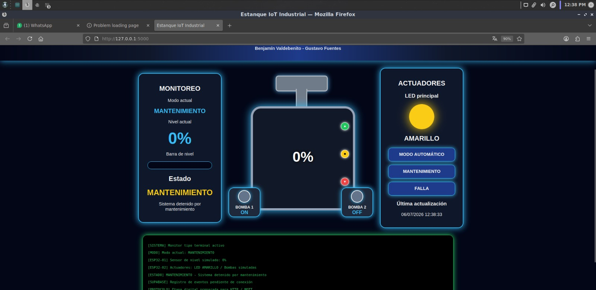
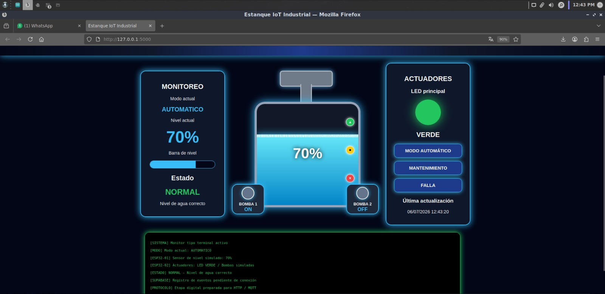
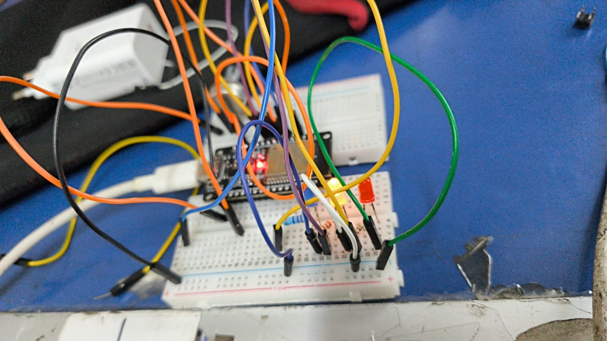

# 🚰 Sistema IoT - Estanque Inteligente

Proyecto desarrollado para la asignatura **Desarrollo de Software**, utilizando **ESP32, Python, Flask, Supabase y GitHub**.

## 👥 Integrantes

- Benjamín Valdebenito
- Gustavo Fuentes

---

# 📖 Descripción

Este proyecto implementa un sistema IoT para el monitoreo y control del nivel de agua de un estanque.

El sistema utiliza dos placas ESP32:

- **ESP32 #1:** Simula el sensor de nivel mediante un potenciómetro y envía continuamente el porcentaje de agua al computador mediante comunicación serial.
- **ESP32 #2:** Funciona como actuador y controla los indicadores LED según el estado del sistema.

La aplicación desarrollada en Python con Flask recibe la información enviada por el ESP32, procesa el nivel del estanque, almacena los eventos en Supabase y actualiza automáticamente la interfaz web.

---

# 🏗 Arquitectura del sistema

```
              ESP32 #1
        (Sensor de Nivel)
               │
      Comunicación Serial
               │
        Python + Flask
               │
      ┌────────┴─────────┐
      │                  │
  Página Web         Supabase
      │
      │ HTTP
      │
   ESP32 #2
 (Actuadores LED)
```

---

# 🛠 Tecnologías utilizadas

- ESP32
- Arduino IDE
- Python
- Flask
- HTML5
- CSS3
- Supabase
- GitHub

---

# ⚙ Funciones del sistema

✅ Monitoreo del nivel de agua.

✅ Actualización automática de la interfaz web.

✅ Cambio de estado según el nivel del estanque.

✅ Modos de operación:

- Automático
- Mantenimiento
- Falla

✅ Control de indicadores LED mediante un segundo ESP32.

✅ Registro automático de eventos en Supabase.

---

# 📷 Capturas del proyecto

## Página principal



---

## Sistema funcionando



---

## ESP32 Sensor



---

## Base de datos Supabase


---

# 📂 Estructura del proyecto

```
estanque-iot/
│
├── app.py
├── requirements.txt
├── README.md
│
├── templates/
│   └── index.html
│
├── static/
│   ├── css/
│   └── img/
│
└── capturas/
```

---

# 🚀 Ejecución

## Instalar dependencias

```bash
pip install flask
pip install pyserial
pip install requests
```

## Ejecutar la aplicación

```bash
python3 app.py
```

## Abrir en el navegador

```
http://127.0.0.1:5000
```

---

# 📊 Base de datos

El sistema almacena automáticamente los eventos del estanque en Supabase.

Cada registro contiene:

- Fecha y hora
- Nivel de agua.
- Estado del sistema.
- Modo de funcionamiento.

---

# 📌 Estado del proyecto

✅ Proyecto finalizado.

- Lectura del nivel mediante ESP32.
- Interfaz web dinámica.
- Actualización automática de datos.
- Comunicación entre dos ESP32.
- Control de indicadores LED.
- Registro de eventos en Supabase.
- Respaldo del código en GitHub.

---

# 📄 Licencia

Proyecto desarrollado únicamente con fines académicos para la asignatura **Desarrollo de Software Para Hardware**.
